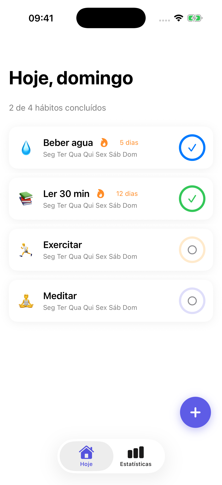
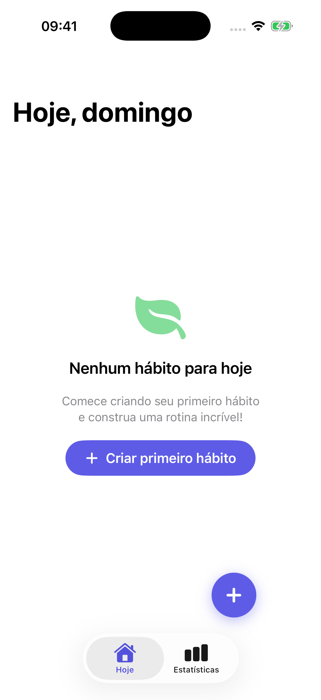
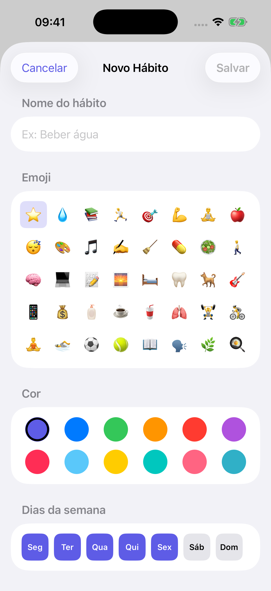
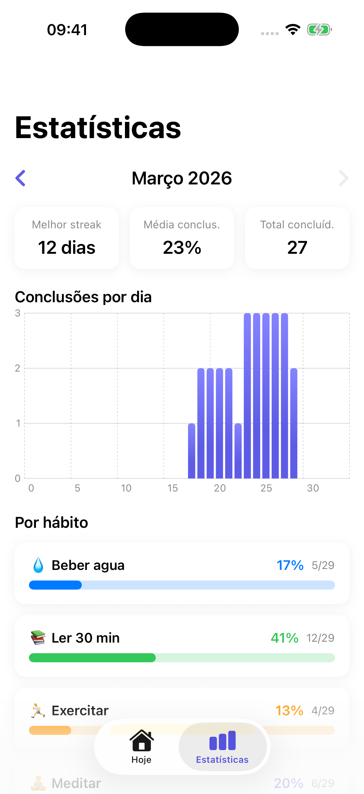

<div align="center">

# HabitFlow

### App iOS de rastreamento de hábitos diários com persistência local, notificações e widget — SwiftUI · SwiftData · Charts · WidgetKit

[](https://developer.apple.com/swift/)
[](https://developer.apple.com/xcode/swiftui/)
[](https://developer.apple.com/documentation/swiftdata)
[](https://developer.apple.com/documentation/charts)
[](https://developer.apple.com/documentation/widgetkit)
[](https://developer.apple.com/xcode/)

</div>

---

## Demo

<div align="center">


</div>

---

## 📱 Sobre o Projeto

**HabitFlow** é um app iOS completo de rastreamento de hábitos que funciona 100% offline. O usuário cria hábitos personalizados com emoji, cor e dias da semana, marca conclusões diárias com animações e haptic feedback, acompanha estatísticas mensais com gráficos nativos do framework Charts, e recebe lembretes via notificações locais. O app também inclui um widget para a homescreen que exibe o progresso do dia em tempo real.

---

## ✨ Funcionalidades

- **Hábitos personalizados** — nome, emoji, cor e dias da semana
- **Conclusão diária** — marcação com animação e haptic feedback
- **Progress ring** — anel circular com o progresso semanal de cada hábito
- **Streak tracking** — contagem de dias consecutivos de conclusão
- **Estatísticas mensais** — gráfico de barras por dia e barra de progresso por hábito
- **Navegação entre meses** — visualização do histórico de qualquer mês
- **Notificações locais** — lembretes configuráveis por horário e dia da semana
- **Widget na homescreen** — tamanhos Small e Medium com dados em tempo real
- **Swipe para excluir** — exclusão rápida com gesto de swipe
- **Context menu** — editar ou excluir via toque longo
- **100% offline** — persistência local com SwiftData, sem dependência de internet

---

## 🛠️ Tecnologias

- **Swift 6** — linguagem principal com strict concurrency
- **SwiftUI** — interface declarativa e reativa
- **SwiftData** — persistência local com @Model e @Query
- **Charts** — gráficos nativos de barras para estatísticas
- **WidgetKit** — widget da homescreen com TimelineProvider
- **UserNotifications** — notificações locais com UNCalendarNotificationTrigger
- **MVVM** — arquitetura com ViewModels usando @Observable

---

## 📁 Estrutura do Projeto

```
HabitFlow/
├── HabitFlowApp.swift
├── Models/
│   ├── Habit.swift
│   └── HabitEntry.swift
├── ViewModels/
│   ├── HabitListViewModel.swift
│   ├── HabitFormViewModel.swift
│   └── StatsViewModel.swift
├── Views/
│   ├── Home/
│   │   ├── HomeView.swift
│   │   ├── HabitRowView.swift
│   │   └── ProgressRingView.swift
│   ├── Form/
│   │   ├── HabitFormView.swift
│   │   ├── EmojiPickerView.swift
│   │   ├── ColorPickerView.swift
│   │   ├── WeekdayPickerView.swift
│   │   └── ReminderPickerView.swift
│   ├── Stats/
│   │   ├── StatsView.swift
│   │   ├── MonthSelectorView.swift
│   │   ├── StreakBarChartView.swift
│   │   └── HabitStatsRowView.swift
│   └── Shared/
│       ├── EmptyStateView.swift
│       └── DeleteConfirmView.swift
├── Services/
│   ├── NotificationService.swift
│   └── WidgetDataService.swift
└── Utils/
    ├── ColorExtension.swift
    ├── DateExtension.swift
    └── Constants.swift

HabitFlowWidget/
├── HabitFlowWidget.swift
├── WidgetBundle.swift
├── WidgetProvider.swift
└── WidgetEntryView.swift
```

---

## 🚀 Como Executar

**1.** Clone o repositório

```bash
git clone https://github.com/GeozedequeGuimaraes/HabitFlow.git
```

**2.** Abra o arquivo `HabitFlow.xcodeproj` no Xcode

**3.** Selecione um simulador ou dispositivo físico

**4.** Execute o projeto com `Cmd + R`

> **Nota:** Para o widget funcionar com dados compartilhados, configure o App Group `group.br.geozedeque.habitflow` nos targets **HabitFlow** e **HabitFlowWidgetExtension** em *Signing & Capabilities*.

---

## 🖼️ Screenshots

<div align="center">

| Home | Home Vazia | Formulário | Estatísticas |
|------|-----------|-----------|-------------|
|  |  |  |  |

</div>

---

## 👤 Autor

<div align="center">

**Geozedeque Guimarães**
Estudante de Ciência da Computação — CIn-UFPE

[](https://github.com/GeozedequeGuimaraes)
[](https://www.linkedin.com/in/geozedeque-guimaraes/)

</div>
